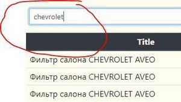
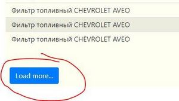

# node_app_1
You can see the working application [here](https://rugged-olympic-29797.herokuapp.com/).

## Summary
The application uses:
- Express.js back-end framework
- MongoDB database
- Vue.js front-end framework
- SCSS and Bootstrap for styling

## Usage
1. Upload a price list to the database using the "price.xlsx" excel file, you can get one [here](https://github.com/RomanKamlykov/node_app_1/raw/master/price.xlsx)

2. Type in keywords and press the "Enter" key to request products from the server,  
you can type in multiple space separated words in the "Title" field in order to specify the request

3. Click the "Load more..." button to request 10 additional products

## Development
1. Create a database at https://mlab.com/
2. Add an ".env" file to the root of the application. Use the ".env_example" file as an example.
3. Run the "npm run dev" script. The application will open in a browser, after that you can upload a price list to the database and use the application to search for goods.

## Deployment
1. Create an account at https://www.heroku.com/
2. Install the [Heroku CLI](https://devcenter.heroku.com/articles/heroku-cli)
3. Change the "api" variable at the "public/services.js" file to production
4. Initialize git, commit the files, except the ".env" file and the "node_modules" folder
5. Run commands "heroku login", "heroku create", "heroku git:remote -a <APP_NAME>", "git push heroku master"
6. Open the heroku app at https://dashboard.heroku.com/apps, add "Config Vars" from the ".env" file

## Application structure
- the "index.js" file is an entry point of the application
- the application api has two routes: "search" and "upload"
- the "upload" route uses the "multer" middleware and the "exceljs" package to get data from an excel file, after that it saves the data in the MongoDB database
- the "search" route queries data from the MongoDB database and sends it to the client